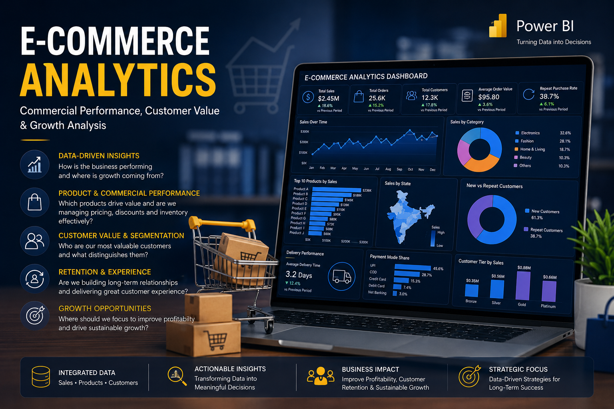
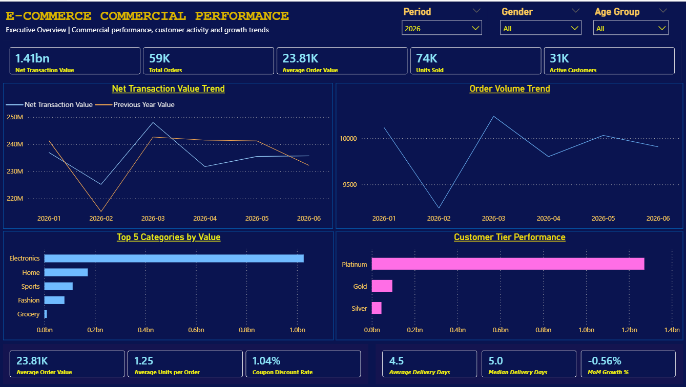
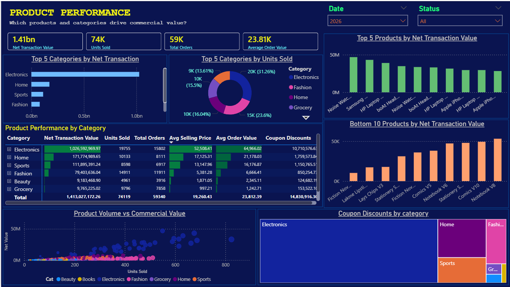
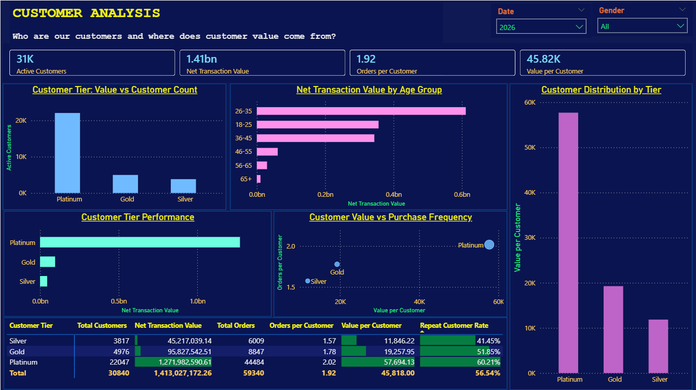
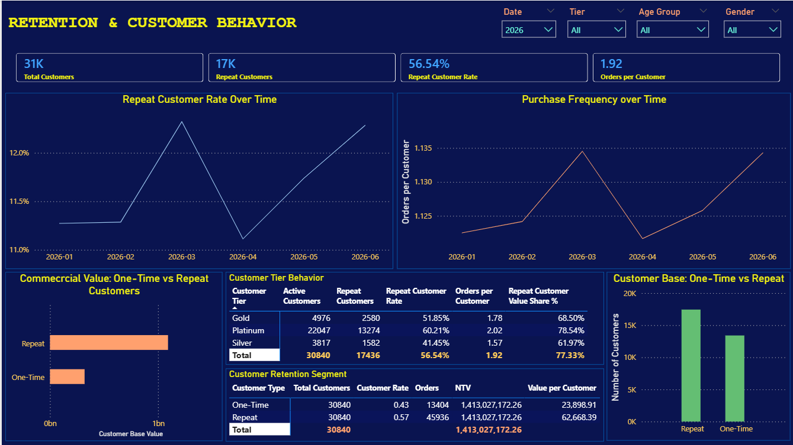
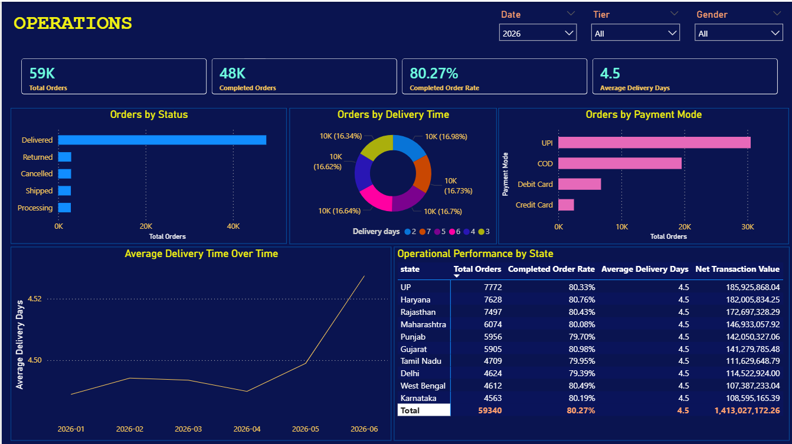

<h1 align = "center">
E-Commerce Commercial Analytics  

# Repository Structure:

    | e-commerce-commercial-analytics/
    │
    ├── data/
    │   ├── raw/
    │   │   ├── sales.csv
    │   │   ├── products.csv
    │   │   └── customers.csv
    │   │
    │   └── processed/
    │       ├── Dim_Customers.csv
    │       ├── Dim_Products.csv
    │       ├── Fact_Sales.csv
    │       └── README.md
    │
    ├── powerbi/
    │   ├── DAX_measure_layer.md
    │   ├── proposed_structure.md
    │   └── e-commerce-sales-analytics.pbix
    │
    ├── documentation/
    │   ├── analysis_charter.md
    │   ├── analysis_report.md
    │   ├── data dictionary.md
    │   └── data_dictionary.md
    │
    ├── screenshots/
    │   ├── executive_overview.png
    │   ├── product_performance.png
    │   ├── customer_analysis.png
    │   ├── operations.png
    │   ├── retention_&_customer_behavior.png
    │   └── growth_opportunities.png
    │
    ├── README.md
    └── .gitignore

# Project Overview

- As an e-commerce company, one of the overarching questions in staying industry-relevant and profitable is: **How can we improve profitability and sustainable growth?** 

- One way of ensuring this is by understanding: 
    - what drives sales, 
    - which products and customers create the most value, and 
    - where are we losing opportunities?

Such questions bring about various analytical dimensions that we are going to segment into six business areas:

1.	Revenue & profitability
2.	Product performance
3.	Customer behavior & value
4.	Customer retention
5.	Operational/market opportunities
6.	Strategic growth

For this e-commerce data analytics project, we are most interested in answering the following 12 interconnected questions:

# Business Questions

### Business performance
-	Is the business growing, and is that growth profitable?
-	Which periods, categories and markets are driving financial performance?
### Product
-	Which products generate the most revenue?
-	Which products generate the most profit?
-	Are our best-selling products also our most profitable products?
-	Which products/categories represent growth opportunities or value-destruction risks?
### Customers
-	Who are our highest-value customers?
-	Which customer segments contribute the most revenue and profit?
-	What behaviors distinguish high-value customers from the rest?
### Retention
-	Are customers returning after their initial purchase?
-	Are we building a sustainable customer base or continually replacing lost customers?
### Commercial strategy
-	Where should management focus resources to improve profitability and long-term growth?

# Dataset

- Sales data: contains transactional records for customer purchases. Each row represents a single order placed on the platform and links customers with products through Customer_ID and Product_ID. This table is ideal for revenue analysis, sales trends, payment analysis, delivery performance, and dashboard development.

- Product data: stores information about products available on the e-commerce platform. It includes product details, pricing, discounts, inventory, ratings, and brand information. Each product is uniquely identified by Product_ID and is connected to sales.csv for transaction analysis.

- Customer data: contains demographic information, contact details, registration history, and purchasing statistics for customers. Each record represents one unique customer and is linked to the sales.csv table through the Customer_ID column. This table is useful for customer segmentation, demographic analysis, customer lifetime value (CLV), and regional sales analysis.

# Tools

- Power BI
- Power Query
- DAX
- Git/GitHub
- Python

# Dashboard

### Page 1: Executive Overview
- This page of the dashboard answers the question: **How is the business performing overall?**

    - Ideally, the interest here is to identify trends such as net transaction over time, which illustrate commercial performance.

    - We are also interested in identifying which product categories drive what proportion of commercial value, which hint at category concentration.

    - Lastly, we want to find out the customer mix i.e., which customer tier contribute to what proportion of transaction value. 

- The net transaction value trend shows a relatively better performance in 2026 compared to the same period in 2025.
    - Therefore, to answer teh question, **is the business growing?** it's safe to allude that the business is generally growing 
    - As to whether the growth is profitable, comparing the two trends shows that the business is selling more product than before, which gives a rough basis for alleging profitability.
    
- In answering teh question **which periods, categories and markets are driving financial performance?** the page shows that: 
    - The end of Q1, between February and March of 2026, saw a rather sharp increase in demand for prouctsproduct performance, 
    - At the same time, the top 5 categories chart shows that electronics drive the majority of commercial value for the e-commerce platform, with over 1 bn Indian rupees in transaction value.
    - The customer tier chart shows that customers classified in the platinum tier drive the majority of commercial value for the platform.

- From the score cards, it's evident that the e-commerce platform is quite efficient in its operations, especially in terms of delivery:
    - We can see that products are delivered in roughly 5 days from date of purchase, which is a relatively effective turn-around time, given each order is valued at about 23,000 Indian rupees.

### Product Performance

This page answers the question: **WHich products are particularly important among premium customers?**

- The page illustrates that in 2026, electonics contribute way more in transaction value than four of the next bigest contributors combined. 
- This observation is backed by the realization that in the same period, electronics were the most sought after products on the platform, with over 20,000 units sold, with only fashion products coming close with 15,000 units sold.
- The chart on net transaction value by product shows that the top 10 products selling on the platform in the 2026 period are all electronics, teh Noise Watch V1 leading the way with transactions worth 46.8 million Indian rupees.

### Customer Analysis

This page is intended to answer the questions **What are we selling? Who is buying? How valuable are they? and How is customer value distributed?**

- It gives insights into who are the most commercially valuable customers to the business, how customer value differs across segments and where the business should focus its customer strategy.

From the illustration above, we can see that the page illustrates that:

   - Most customers using the platform subscribe to the **platinum** tier, the tier boasting over 20,000 customers who transacted in 2026 alone.

   - The most value is driven by customers in the platinum tier, who were involved in transactions worth over 1.25 billion rupees in 2026.

   - Again, customers subscribing to the platinum tier turn out to make the most purchases per trasaction, averaging 2 orders per customer.

   - This page further stamps the value of customers subsrcibing to the platinum tier, indicating they are the most likely to repeatedly purchase products through the platform. 
       - It shows that platinum customers are 60.2% likely to purchase products again using the platform, gold tier customers only coming second with 52.8% chances of becoming repeat customers.

   - The score cards, illustrate that each customer using the platform is involved in transactions worth an average of 45,800 rupees.

### Retention & Customer Behavior

This page was intended to answer the question: **Who are our customers and where does customer value come from?**

- The interest here is to discern whether customers are coming back, and if they are, how frequently do they purchase, and how does their behavior change over time?

The page shows that in 2026:

- A surge in repeat customers was realized between February and March, and between April and June

    - This trend simultaneously coincided with a surge in purchase frequency in the said periods 

- The commercial value chart illustrates that repeat customers drive transaction value, with this group being involved in transactions worth more than 1 billion rupees between January and June of 2026.

### Operations

This page is intended to answer the questions: **How effectively is the business fulfilling customer orders? and Where are operational problems affecting customer experience or commercial performance?**

### Growth Opportunities

# Key Findings

Brief summary of the most important findings.

# Recommendations

Summary of recommended business actions.

# Project Structure

Explanation of the repository folders.