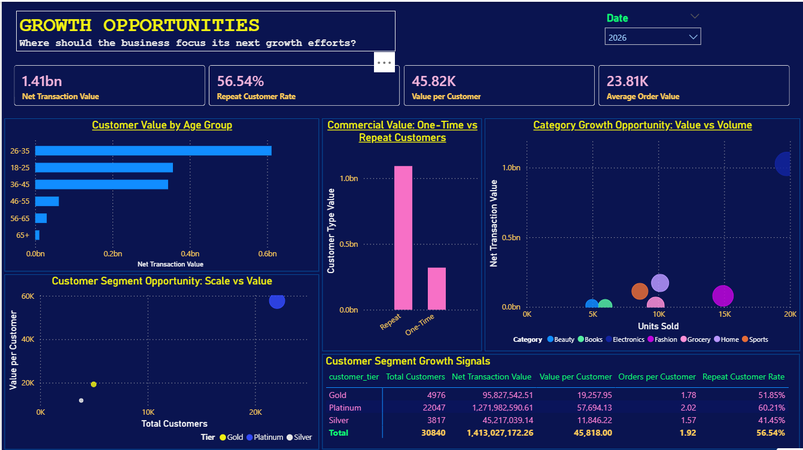

<h1 align = "center">
E-Commerce Commercial Analytics  

# Repository Structure:

    | e-commerce-commercial-analytics/
    │
    ├── data/
    │   ├── raw/
    │   │   ├── sales.csv
    │   │   ├── products.csv
    │   │   └── customers.csv
    │   │
    │   └── processed/
    │       ├── Dim_Customers.csv
    │       ├── Dim_Products.csv
    │       ├── Fact_Sales.csv
    │       └── README.md
    │
    ├── powerbi/
    │   ├── DAX_measure_layer.md
    │   ├── proposed_structure.md
    │   └── e-commerce-sales-analytics.pbix
    │
    ├── documentation/
    │   ├── analysis_charter.md
    │   ├── analysis_report.md
    │   ├── data dictionary.md
    │   └── data_dictionary.md
    │
    ├── screenshots/
    │   ├── executive_overview.png
    │   ├── product_performance.png
    │   ├── customer_analysis.png
    │   ├── operations.png
    │   ├── retention_&_customer_behavior.png
    │   └── growth_opportunities.png
    │
    ├── README.md
    └── .gitignore

# Project Overview

- As an e-commerce company, one of the overarching questions in staying industry-relevant and profitable is: **How can we improve profitability and sustainable growth?** 

- One way of ensuring this is by understanding: 
    - what drives sales, 
    - which products and customers create the most value, and 
    - where is the business losing opportunities?

Such questions bring about various analytical dimensions that we are going to segment into six business areas:

1.	Revenue & profitability
2.	Product performance
3.	Customer behavior & value
4.	Customer retention
5.	Operational/market opportunities
6.	Strategic growth

For this e-commerce data analytics project, we are most interested in answering the following 12 interconnected questions:

# Business Questions

### Business performance
-	Is the business growing, and is that growth profitable?
-	Which periods, categories and markets are driving financial performance?
### Product
-	Which products generate the most revenue?
-	Which products generate the most profit?
-	Are our best-selling products also our most profitable products?
-	Which products/categories represent growth opportunities or value-destruction risks?
### Customers
-	Who are our highest-value customers?
-	Which customer segments contribute the most revenue and profit?
-	What behaviors distinguish high-value customers from the rest?
### Retention
-	Are customers returning after their initial purchase?
-	Are we building a sustainable customer base or continually replacing lost customers?
### Commercial strategy
-	Where should management focus resources to improve profitability and long-term growth?

# Dataset

- Sales data: contains transactional records for customer purchases. Each row represents a single order placed on the platform and links customers with products through Customer_ID and Product_ID. This table is ideal for revenue analysis, sales trends, payment analysis, delivery performance, and dashboard development.

- Product data: stores information about products available on the e-commerce platform. It includes product details, pricing, discounts, inventory, ratings, and brand information. Each product is uniquely identified by Product_ID and is connected to sales.csv for transaction analysis.

- Customer data: contains demographic information, contact details, registration history, and purchasing statistics for customers. Each record represents one unique customer and is linked to the sales.csv table through the Customer_ID column. This table is useful for customer segmentation, demographic analysis, customer lifetime value (CLV), and regional sales analysis.

# Tools

- Power BI
- Power Query
- DAX
- Python
- Git/GitHub

# Dashboard

## Page 1: Executive Overview
- This page of the dashboard answers the question: **How is the business performing overall?**

    - Ideally, our interest here is to identify trends such as net transaction over time, which illustrate commercial performance.

    - We are also interested in identifying which product categories drive what proportion of commercial value, which hint at category concentration.

    - Lastly, we want to find out the customer mix i.e., which customer tier contribute to what proportion of transaction value. 

### Key Findings: Period - 2026
- In 2026, between January and June, the net transaction value trend shows a relatively better performance compared to the same period in 2025.
    - This allows for the assumption that the business is growing, as the net transaction in 2026 is an improvement on the net transaction in the previous year. 
        - This helps answer the question of whether the business growing.
        - This assumption is drawn from equating higher revenue to improved product sale, assuming the product prices remain the same.  
        
- In answering the question of which periods drive financial performance? the executive overview paints a clear picture that: 

    - The end of Q1, between February and March of 2026, indicates a rather sharp increase in demand for proucts under order volume trend. 

        - This we can take to mean that the business enjoys a good spell of product sales during this period compared to other seasons through the year. 

- On the question of which products drive financial performance, this overview shows that:

    - Electronics drive the majority of commercial value for the business, with over 1 bn Indian rupees in transaction value, evidence from the topn 5 categories by value chart.

- Similarly, on the question of which customers drive financial performance, the executive overview shows that:

    - Customers in the platinum tier drive the majority of commercial value for the platform.

        - This tier, from the customer tier performance chart, is involved in transactions worth more than 1.2 billion rupees.

        - The second tier, by a distance, is Gold tier, which is responsible for close to 100 million rupees.

- From the score cards, it's evident that the e-commerce platform is quite efficient in its operations, especially in terms of delivery:

    - Products are delivered in roughly 5 days from date of purchase, which is a relatively effective turn-around time.

    - The delivery time is impressive given each order is valued at about 23,000 Indian rupees.

### Recommendations
- Given the business tends to draw higher volumes in customer traffic during the February-March period, the strategy should be to target huge sale volumes during this period

    - One recommended approach would be for the business incentivize its products more during this period by offering significant discounts during this period and capitalize on the high customer traffic.

    - An alternative approach would be to promote products more aggressively during this period through allied platforms with the aim of capitalizing on the huge traffic.

- Regarding capitalizing on consummer segmentation, the busines is advised to capitalize on promoting its product  more aggressively to customers in the platinum tier, as this class of consumers tends to drive product sales.

    - At the same time, the business is advised to explore the option of incentivizing its product to attract more customers in the gold and silver tiers
    
## Page 2: Product Performance

- This page answers the question: **Which products are particularly important among premium customers?**

 - Here, our biggest interest is to get insights regarding:

    - Categories that generate the most value
    - Products that drive value
    - Commercial value coming from volume or price
    - Whether there are products or categories that deserve management attention.

### Key Findings: Period - 2026
- The page illustrates that in 2026, the top 5 performing products came from electonics, home, sports, fahion and grocery categories.

    - It further illustrates that electronics contributed significantly more in transaction value than other four categories combined. 

- In terms of products that drive value, in the same period, electronics emerged as the most sought after products for the business:

    - Over 20,000 units were sold, 
    - Only fashion products came close in terms of products sold, with 15,000 units sold.

- In terms of net transaction value by product the top 10 products selling on the platform in 2026 period are all electronics.
    - Best selling product overall is the Noise Watch V1 generating over 46.8 million Indian rupees in revenue.
    - Samsung Mobile comes close second, generating over 43.1 million Indian rupees in revenue

- Elsewhere, the least cummulative revenue by product was generated by fiction novels, generating 10 million rupees in revenue. 

    - This, however, should not be taken as the worst performing product on the platform, given the low unit price of the product, compared to others.

        - Instead, the performance could be judged in terms of units sold. 
### Recommendations

- With electronics driving transaction value the most, the business is advised to give priority to this category of products to drive sales even further in future, even as it intends to diversify its portfolio to attract different customer tiers.

- Although novels and other books looked to lead to least revenue by product, the business is advised against discarding this product since the net revenue may not tell the whole story about its performance. 

    - Instead, the business is advised to monitor the product by units sold over the course of its financial year to discern whether proportions sold are encouraging.

## Page 3: Customer Analysis

This page is intended to answer the questions: 
- **What are we selling?** 
- **Who is buying?** 
- **How valuable are they?** and 
- **How is customer value distributed?**

- What we are interested in most is to get insights into who are the most commercially valuable customers to the business, how customer value differs across segments and where the business should focus its customer strategy.

### Key Findings: Period - 2026
From the illustration above, it's evident that:

   - Most customers using the platform subscribe to the **platinum** tier.
    - Platinum tier boasts over 20,000 customers who transacted in 2026 alone.
    - Gold tier customers, on the other hand, are just shy of 5,000  

   - The most value is driven by customers in the platinum tier, who were involved in transactions worth over 1.25 billion rupees in 2026.

   - Again, customers subscribing to the platinum tier turn out to make the most purchases per trasaction, averaging 2 orders per customer.

   - This page further stamps the value of customers subsrcibing to the platinum tier, indicating they are the most likely to repeatedly purchase products through the platform. 

       - It shows that platinum customers are 60.2% likely to purchase products again using the platform, gold tier customers only coming second with 52.8% chances of becoming repeat customers.

   - The score cards, illustrate that each customer using the platform is involved in transactions worth an average of 45,800 rupees.

### Recommendations

- As already established, customers subscribing to the platinum tier drive the most value, therefore, the business is advised to prioritize product demand dictated by this tier.

## Page 4: Retention & Customer Behavior

- This page seeks to answer the question: **Who are our customers and where does customer value come from?**

- The interest here is to discern whether customers are coming back, and if they are, how frequently do they purchase, and how does their behavior change over time?

### Key Findings: Period - 2026

- A surge in repeat customers was realized between February and March, and between April and June

    - This trend simultaneously coincided with a surge in purchase frequency in the said periods 

- The commercial value chart illustrates that repeat customers drive transaction value, with this group being involved in transactions worth more than 1 billion rupees between January and June of 2026.

### Recommendations

- The business is advised to prioritize product promotion during the periods February-March and April-June to capitalize on egagement of repeat customers and the upsurge of purchase frequency.

## Page 5: Operations

- This page is intended to answer the questions:

    - **How effectively is the business fulfilling customer orders?** and 
    
    - **Where are operational problems affecting customer experience or commercial performance?**

Here we are interested in drawing insights into what will improve order fulfillment, delivery performance, order-status outcomes and operational patterns over time and across locations.

### Key Findings: Period - 2026

- Out of 59,000 orders placed, 80.27% were fulfilled, translating to moe than 49,000 orders being delivered between January and June of 2026

- 2,900 orders were cancelled in the same duration, with a further 2,900 returned.

- As at time of reporting, 6,000 orders are either under processing or being shipped

- Orders placed by customers are delivered in an average of 4.5 days. However, toward June of 2026, the turn-around time is seen to increase significantly

- UP state drives the most order placed, followed closely by Haryana and Rajasthan, respectively.
     - UP accounted for 7772 orders placed between January and June 2026
     - Haryana accounted for 7628 orders placed in the same duration, while Rajasthan accounted for 7497 orders.

- The majority of orders, more than 30,000, were paid for using UPI, with COD payment following closely with 19,000 orders

### Recommendations

- The business is advised to:
    - Uphold, or improve the current order delivery turn-around time
    - Look into factors inflating the turn-around time for order delivery toward June

- The business is also advised to promote UPI payment for customers as it emerges as the most convenient mode of payment.

## Page 6: Growth Opportunities

- This page intends to provide insights into where the business can realistically grow commercial value, and which customers, products and market opportunities deserve attantion

- The key is to answer the questions on:

    - Where we can increase repeat purchasing
    - Which products or categories have strong commercial potential
    - Which customer segments or states are commercially attractive

### Key Findings: Period - 2026

- Between January and June 2026, repeat customers have driven commercial value the most for the business, accounting for over 1.2 billion rupees in revenue

- Consumers aged between 26 and 35 contributed most to the business revenue, driving value by up to 0.6 billion rupees in revenue

- The business is enjoying a 56.54% rate of customers becoming repeat customers

### Recommendations

- The business is advised to prioritize converting customers to repeat customers as it drives more value than one-time customer transaction.

- By age, the business is advised to stock more products that appeal to customers above the age of 25, as this age group drives more value than any other. 

# Project Structure

Explanation of the repository folders.